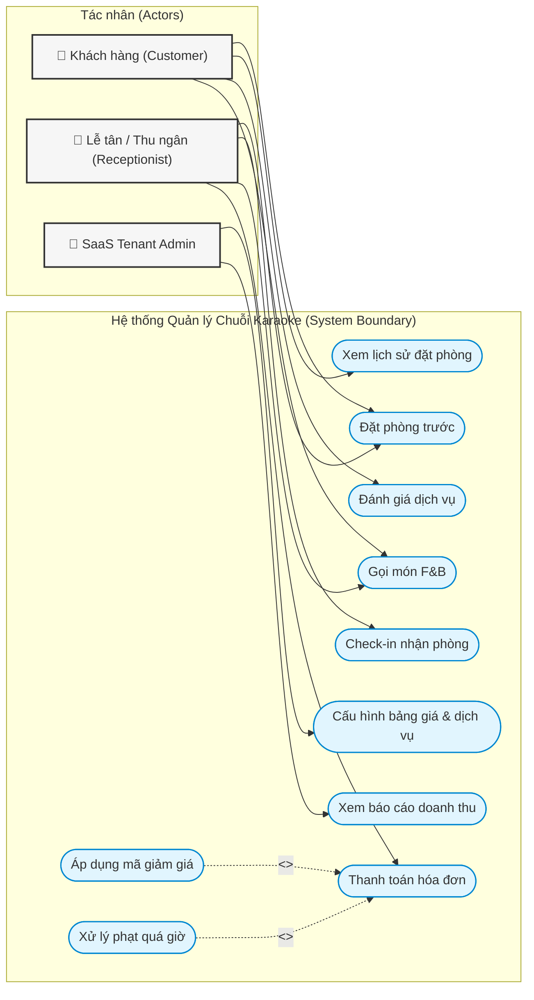
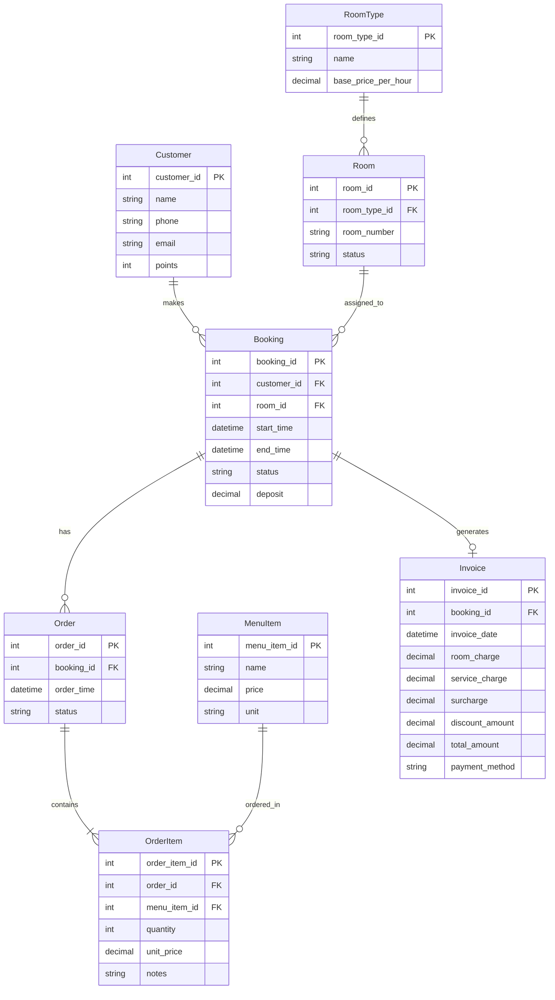

# TÀI LIỆU ĐẶC TẢ YÊU CẦU HỆ THỐNG (SYSTEM SPECIFICATION)
## DỰ ÁN: HỆ THỐNG QUẢN LÝ CHUỖI PHÒNG HÁT KARAOKE (SaaS Model)

---

## 1. MỤC TIÊU CỐT LÕI CỦA DỰ ÁN (CORE OBJECTIVES)

*   **Tối ưu hóa Vận hành & Chống thất thoát:** Số hóa toàn bộ quy trình vận hành tại quầy POS và phòng hát. Tự động tính tiền giờ và trừ kho nguyên vật liệu theo công thức định lượng (recipe), giảm thiểu sai sót và gian lận.
*   **Nâng cao Trải nghiệm Khách hàng:** Cung cấp trải nghiệm tự đặt phòng (Self-booking), tự gọi món (Self-ordering qua QR Code) và theo dõi hóa đơn trực tiếp, giúp tối ưu thời gian phục vụ.
*   **Quản trị Chuỗi tập trung dựa trên Dữ liệu:** Cung cấp hệ thống báo cáo thông minh (BI Dashboards) thời gian thực về doanh thu, hiệu suất sử dụng phòng của từng chi nhánh và toàn chuỗi cho các chủ doanh nghiệp.
*   **Chuẩn hóa SaaS Multi-tenant Platform:** Đảm bảo hệ thống có khả năng mở rộng (scalability), cô lập dữ liệu tuyệt đối giữa các tenant và dễ dàng onboarding chuỗi karaoke mới.

---

## 2. TÁC NHÂN HỆ THỐNG (ACTORS)

| Tác nhân | Mô tả vai trò | Giao diện tương tác |
| :--- | :--- | :--- |
| **SaaS Tenant Admin** | Chủ chuỗi hoặc quản trị viên doanh nghiệp. Cấu hình hệ thống, quản lý tài chính và nhân sự toàn chuỗi. | Web Admin Portal (Desktop/Responsive) |
| **Lễ tân / Thu ngân** | Vận hành check-in, check-out, gán phòng, thêm dịch vụ và thanh toán hóa đơn trực tiếp tại quầy. | Web POS Application (Tối ưu cảm ứng & phím tắt) |
| **Khách hàng** | Người hát karaoke. Đặt phòng online, tự order F&B tại phòng qua QR Code, theo dõi hóa đơn và đánh giá dịch vụ. | Mobile App / Mobile Web Portal |
| **Phục vụ / Bếp / Bar** | Nhân viên phục vụ phòng nhận order và dọn phòng. Nhân viên bếp/bar chế biến đồ ăn, thức uống. | Mobile Handheld App / Kitchen Display System (KDS) |
| **Thủ kho** | Quản lý nhập, xuất, kiểm kê hàng hóa tại kho của từng chi nhánh hoặc kho tổng. | Web/App Inventory Module |

---

## 3. PHÂN HỆ CỐT LÕI & YÊU CẦU CHỨC NĂNG (FUNCTIONAL REQUIREMENTS)

### 3.1. Phân hệ Quản lý Đặt phòng & Vận hành thời gian thực
Phân hệ điều phối dòng vận hành chính của quán qua **4 trạng thái phòng**: `Đang trống (Vacant)`, `Đặt trước (Reserved)`, `Đang hát (Occupied)`, và `Đang dọn (Cleaning)`.

*   **FR-01: Quản lý Sơ đồ Phòng và Trạng thái Thời gian thực**
    *   *Mô tả:* Hiển thị trực quan sơ đồ phòng hát theo luồng chuyển đổi trạng thái bằng màu sắc. Trạng thái tự động cập nhật ngay lập tức tới lễ tân, phục vụ và bếp qua WebSocket.
    *   *Đầu vào:* Sự kiện từ Lễ tân (Check-in, Check-out), Khách hàng (Đặt phòng) hoặc Phục vụ (Báo đã dọn xong).
    *   *Đầu ra:* Giao diện sơ đồ phòng cập nhật trạng thái mới nhất kèm bộ đếm thời gian thực cho các phòng đang hoạt động.
*   **FR-02: Đặt phòng trước (Reservation)**
    *   *Mô tả:* Ghi nhận thông tin đặt phòng trước của khách hàng, tự động chuyển phòng từ trạng thái `Đang trống` sang `Đặt trước` và khóa phòng trong khoảng thời gian quy định trước giờ hẹn để tránh trùng lịch.
    *   *Đầu vào:* Thông tin khách hàng (Tên, SĐT), Chi nhánh, Loại phòng/Số phòng, Giờ nhận phòng, Tiền đặt cọc.
    *   *Đầu ra:* Trạng thái phòng chuyển sang `Đặt trước`. Gửi mã QR đặt phòng tự động qua SMS/Zalo cho khách hàng.
*   **FR-03: Nhận phòng & Kích hoạt tính giờ (Check-in)**
    *   *Mô tả:* Chuyển trạng thái phòng từ `Đang trống` hoặc `Đặt trước` sang `Đang hát`, tự động ghi nhận thời gian bắt đầu sử dụng phòng và kích hoạt bộ đếm giờ tính tiền.
    *   *Đầu vào:* Thao tác click "Nhận phòng" của lễ tân (quét QR đặt chỗ hoặc chọn phòng trực tiếp) và cấu hình bảng giá áp dụng.
    *   *Đầu ra:* Trạng thái phòng chuyển sang `Đang hát`. Ghi nhận thời gian bắt đầu chính xác đến giây. Đồng hồ tính tiền bắt đầu chạy.
*   **FR-04: Trả phòng & Tạm tính hóa đơn (Check-out)**
    *   *Mô tả:* Dừng tính tiền giờ và chuyển trạng thái phòng từ `Đang hát` sang `Đang dọn`. Hệ thống tự động tổng hợp toàn bộ chi phí sử dụng phòng và dịch vụ để tạo hóa đơn tạm tính.
    *   *Đầu vào:* Thao tác chọn phòng đang hát và click "Trả phòng / Check-out" của lễ tân.
    *   *Đầu ra:* Trạng thái phòng chuyển sang `Đang dọn`. Xuất hóa đơn tạm tính chi tiết (tiền giờ, tiền F&B, phụ thu, đặt cọc khấu trừ).
*   **FR-11: Tự động tính Phụ thu và Phạt quá giờ**
    *   *Mô tả:* Xử lý các trường hợp ngoại lệ về thời gian và vệ sinh:
        *   *Phạt quá giờ đặt chỗ:* Tự động tính tiền phạt lũy tiến theo cấu hình nếu khách trả phòng trễ so với block giờ đặt trước.
        *   *Phụ thu ngoài giờ vận hành:* Tự động cộng thêm % hóa đơn nếu khách hát quá giờ đóng cửa quy định.
        *   *Phụ thu vệ sinh:* Cho phép lễ tân áp dụng thủ công phí phạt nếu khách hàng làm bẩn/hỏng tài sản phòng vượt mức quy định.
    *   *Đầu vào:* Cấu hình quy tắc phạt/phụ thu trong DB, thời gian trả phòng thực tế so với lịch đặt, hoặc lựa chọn phụ thu vệ sinh của lễ tân.
    *   *Đầu ra:* Hiển thị chi tiết dòng chi phí phạt/phụ thu (surcharge line items) trên hóa đơn.
*   **FR-12: Xác nhận hoàn tất dọn phòng**
    *   *Mô tả:* Cho phép nhân viên phục vụ phòng báo cáo hoàn tất việc vệ sinh và kiểm tra tài sản phòng hát sau khi khách check-out để đưa phòng trở lại kinh doanh.
    *   *Đầu vào:* Thao tác click "Hoàn tất dọn phòng" của nhân viên phục vụ trên Mobile App.
    *   *Đầu ra:* Trạng thái phòng chuyển từ `Đang dọn` về `Đang trống`. Hệ thống ghi nhận hiệu suất thời gian dọn phòng của nhân viên.

---

### 3.2. Phân hệ POS & Quản lý Kho hàng định lượng

*   **FR-05: Ghi nhận Order dịch vụ tại phòng**
    *   *Mô tả:* Cho phép ghi nhận yêu cầu gọi đồ ăn, nước uống hoặc dịch vụ khác của phòng đang hoạt động (trạng thái `Đang hát`).
    *   *Đầu vào:* Số phòng đang hát, mã hàng hóa/dịch vụ, số lượng, ghi chú món từ khách hàng (QR code) hoặc phục vụ (Mobile App).
    *   *Đầu ra:* Yêu cầu order được lưu tạm vào hệ thống dưới trạng thái "Chờ xử lý".
*   **FR-13: Tự động điều hướng và đồng bộ Order xuống Bếp/Bar**
    *   *Mô tả:* Hệ thống tự động phân loại mặt hàng trong đơn order để điều hướng trực tiếp xuống nơi chế biến mà không cần lễ tân duyệt lại:
        *   Món ăn tự động truyền tới máy in/màn hình tại khu vực **Bếp (Kitchen)**.
        *   Đồ uống/Trái cây tự động truyền tới máy in/màn hình tại khu vực **Bar (Pha chế)**.
    *   *Đầu vào:* Đơn order dịch vụ được gửi. Phân loại mặt hàng trong danh mục (Food vs. Drink).
    *   *Đầu ra:* Thông tin món ăn hiển thị trên màn hình bếp hoặc tự động in phiếu chế biến tại bếp/bar; gửi thông báo tới App phục vụ khi bếp báo món "Đã xong".
*   **FR-06: Trừ kho tự động theo Định lượng**
    *   *Mô tả:* Khi một món ăn/đồ uống được bếp/bar báo "Đã xong", hệ thống tự động trừ kho nguyên vật liệu tương ứng theo công thức định lượng (Recipe) đã thiết lập sẵn.
    *   *Đầu vào:* Trạng thái món chuyển sang "Đã xong" và cấu hình định lượng (ví dụ: 1 Cốc sinh tố bơ = 1 quả bơ + 50ml sữa tươi).
    *   *Đầu ra:* Số dư tồn kho của nguyên vật liệu liên quan trong kho chi nhánh được cập nhật giảm xuống.
*   **FR-07: Quản lý Xuất/Nhập/Kiểm kho chi nhánh**
    *   *Mô tả:* Hỗ trợ thủ kho thực hiện nhập hàng từ nhà cung cấp, xuất kho nội bộ giữa các chi nhánh, và lập phiếu kiểm kê để đối chiếu số lượng thực tế với hệ thống.
    *   *Đầu vào:* Loại phiếu (Nhập/Xuất/Kiểm), danh sách mã hàng hóa, số lượng thực tế kiểm kê, lý do điều chỉnh.
    *   *Đầu ra:* Số dư tồn kho hệ thống được cập nhật khớp với số lượng thực tế kiểm kê; xuất báo cáo chênh lệch hao hụt/thặng dư.

---

### 3.3. Phân hệ Quản trị Chuỗi & Báo cáo Thông minh

*   **FR-08: Thiết lập Cấu hình Giá, Phụ thu & Khung giờ**
    *   *Mô tả:* Quản trị viên thiết lập cấu hình giá phòng và quy tắc phụ thu/phạt quá giờ cho toàn chuỗi hoặc tùy chỉnh riêng biệt cho từng chi nhánh.
    *   *Đầu vào:* Đơn giá phòng theo hạng (Thường/VIP), cấu hình khung giờ vàng, quy định phạt quá giờ, và ngày áp dụng (ngày thường, cuối tuần, ngày lễ).
    *   *Đầu ra:* Quy tắc tính giá và phụ thu được lưu trữ và áp dụng đồng bộ thời gian thực cho chi nhánh tương ứng.
*   **FR-09: Dashboard Báo cáo Doanh thu & Hiệu suất Chuỗi**
    *   *Mô tả:* Tổng hợp dữ liệu giao dịch toàn chuỗi để hiển thị dưới dạng các biểu đồ trực quan về doanh thu, hiệu suất sử dụng phòng hát và sản lượng F&B bán ra theo thời gian thực.
    *   *Đầu vào:* Bộ lọc thời gian (ngày, tuần, tháng, năm), bộ lọc chi nhánh.
    *   *Đầu ra:* Biểu đồ doanh thu trực quan, báo cáo tỷ lệ lấp đầy phòng, xuất báo cáo ra các định dạng Excel/PDF.
*   **FR-10: Quản lý Phân quyền theo vai trò (RBAC)**
    *   *Mô tả:* Phân chia quyền hạn và giới hạn phạm vi hiển thị dữ liệu của từng tài khoản nhân viên theo vai trò và chi nhánh làm việc để đảm bảo an toàn thông tin cấp SaaS.
    *   *Đầu vào:* Thông tin nhân viên, vai trò (Role), danh sách quyền hạn chi tiết (Permissions).
    *   *Đầu ra:* Tài khoản nhân viên được áp dụng cấu hình phân quyền mới; hệ thống tự động kiểm tra quyền khi truy cập chức năng.

---

## 4. SƠ ĐỒ USE CASE (USE CASE DIAGRAM)

Sơ đồ thể hiện mối quan hệ giữa 3 Actors chính và các Use Cases cốt lõi trong hệ thống:

---

## 5. USER STORIES

### 5.1. SaaS Tenant Owner / Admin
*   **US-01 (Cấu hình giá & Phụ thu):** *As a* Tenant Owner, *I want to* thiết lập bảng giá phòng động theo khung giờ/ngày lễ và các quy tắc phạt quá giờ cho từng chi nhánh, *So that* hệ thống tự động tính hóa đơn chính xác, tránh thất thoát doanh thu và giảm thiểu sai sót thủ công của lễ tân.
*   **US-02 (Quản trị chi nhánh & Phòng):** *As a* Tenant Owner, *I want to* quản lý thông tin các chi nhánh, danh sách phòng và loại phòng trên hệ thống, *So that* tôi có thể dễ dàng mở rộng quy mô kinh doanh hoặc thay đổi bố trí phòng hát khi cần thiết.
*   **US-03 (Dashboard Báo cáo thông minh):** *As a* Tenant Owner, *I want to* xem dashboard báo cáo thời gian thực về doanh thu (tiền giờ, F&B), hiệu suất sử dụng phòng (occupancy rate) toàn chuỗi, *So that* tôi có thể đưa ra các quyết định kinh doanh kịp thời và tối ưu hóa chi phí vận hành từ xa.
*   **US-04 (Phân quyền bảo mật RBAC):** *As a* Tenant Owner, *I want to* tạo tài khoản nhân viên và phân quyền chi tiết theo vai trò (lễ tân, phục vụ, bếp, thủ kho), *So that* tôi có thể bảo mật thông tin tài chính nhạy cảm và kiểm soát chặt chẽ các tác vụ nhạy cảm.

### 5.2. Receptionist / Cashier
*   **US-05 (Theo dõi sơ đồ phòng):** *As a* Receptionist, *I want to* theo dõi sơ đồ phòng hiển thị trực quan trạng thái thời gian thực, *So that* tôi có thể nắm bắt tình trạng phòng ngay lập tức và sắp xếp phòng cho khách nhanh chóng.
*   **US-06 (Check-in nhanh):** *As a* Receptionist, *I want to* check-in cho khách để kích hoạt giờ hát tự động, *So that* hệ thống bắt đầu tính tiền giờ chính xác và thông báo cho bộ phận phục vụ chuẩn bị đón khách.
*   **US-07 (Check-out & Tính phụ thu tự động):** *As a* Cashier, *I want to* thực hiện trả phòng cho khách, hệ thống tự động tính tiền giờ và cộng thêm các khoản phụ thu/phạt quá giờ (nếu có), *So that* tôi có thể in hóa đơn tạm tính và thanh toán cho khách chính xác chỉ bằng vài cú click chuột.
*   **US-08 (Kích hoạt luồng dọn phòng):** *As a* Cashier, *I want to* hệ thống tự động chuyển trạng thái phòng sang "Đang dọn" ngay sau khi in hóa đơn thanh toán, *So that* nhân viên phục vụ phòng biết và tiến hành dọn dẹp ngay mà không cần tôi gọi điện báo.

### 5.3. Customer
*   **US-09 (Tự đặt phòng online):** *As a* Customer, *I want to* xem danh sách phòng trống, giá cả trực tuyến và tự đặt phòng qua điện thoại của mình, *So that* tôi chắc chắn có phòng VIP khi đến quán mà không cần gọi điện chờ đợi lễ tân.
*   **US-10 (Quét QR tự Order F&B tại phòng):** *As a* Customer, *I want to* quét mã QR đặt tại phòng để xem thực đơn điện tử và tự gọi món ăn/nước uống, *So that* tôi có thể gọi thêm đồ nhanh chóng mà không cần ngắt quãng cuộc vui để tìm nhân viên phục vụ.
*   **US-11 (Theo dõi hóa đơn tạm tính):** *As a* Customer, *I want to* xem hóa đơn tạm tính thời gian thực (gồm tiền giờ đang chạy và danh sách món đã gọi) trên điện thoại cá nhân, *So that* tôi chủ động kiểm soát chi tiêu và kiểm tra tính chính xác của hóa đơn trước khi ra quầy thanh toán.
*   **US-12 (Xem lịch sử đặt phòng & Đánh giá):** *As a* Customer, *I want to* xem lịch sử đặt phòng và gửi đánh giá dịch vụ sau mỗi lần trải nghiệm, *So that* tôi có thể theo dõi thói quen chi tiêu và đóng góp ý kiến nâng cao chất lượng quán hát.

### 5.4. Service / Kitchen / Bar Staff
*   **US-13 (Tiếp nhận Order tại Bếp/Bar):** *As a* Kitchen/Bar Staff, *I want to* nhận thông báo order tự động hiển thị trên màn hình chế biến ngay khi khách/phục vụ gửi order, *So that* tôi có thể chế biến nhanh chóng và chính xác theo thứ tự.
*   **US-14 (Xác nhận dọn phòng xong):** *As a* Room Attendant, *I want to* bấm nút "Hoàn tất dọn phòng" trên app di động sau khi dọn xong phòng ở trạng thái "Đang dọn", *So that* phòng tự động chuyển về trạng thái "Đang trống" trên màn hình của lễ tân để tiếp tục đón khách mới.

---

## 6. YÊU CẦU PHI CHỨC NĂNG (NON-FUNCTIONAL REQUIREMENTS)

### 6.1. Performance (Hiệu năng)
*   **API Response Time:** 95% số request API thông thường (Check-in, Check-out, gán phòng) phản hồi `< 200ms`, và 99% phản hồi `< 500ms` dưới điều kiện tải thông thường.
*   **Order Transmission Latency:** Thời gian truyền tải dữ liệu order F&B từ khách hàng/phục vụ đến bếp/bar hoàn tất trong vòng `< 1.0 giây`.
*   **State Sync Latency:** Thời gian đồng bộ trạng thái phòng qua WebSockets giữa các client (Lễ tân, Phục vụ, Bếp) hoàn tất trong vòng `< 500ms`.
*   **Page Load Time:** Thời gian tải trang Web POS lần đầu `< 2.5 giây` ở tốc độ mạng di động 4G thông thường.
*   **Throughput:** Hệ thống chịu tải tối thiểu **500 TPS** trên mỗi Tenant và **5,000 TPS** trên toàn bộ hệ thống SaaS trong các dịp cao điểm.

### 6.2. Security (Bảo mật)
*   **Data Encryption:** 100% kết nối truyền tải dữ liệu bắt buộc mã hóa qua **HTTPS** và **WSS** sử dụng giao thức **TLS 1.3**. Dữ liệu lưu trữ (mật khẩu, SĐT, tài chính) được mã hóa bằng thuật toán **AES-256** hoặc băm qua **Argon2id/bcrypt**.
*   **Data Isolation:** Cô lập hoàn toàn dữ liệu giữa các Tenant bằng cơ chế **Row-Level Security (RLS)** trên DB hoặc sử dụng database riêng cho từng Tenant. Tỷ lệ rò rỉ dữ liệu giữa các Tenant phải bằng **0%**.
*   **Audit Logging:** 100% thao tác điều chỉnh hóa đơn, thay đổi tiền giờ, hoặc áp dụng phụ thu phạt phải được ghi log kiểm toán (Audit Trail) cố định, không thể chỉnh sửa và lưu trữ tối thiểu **365 ngày**.
*   **Session Management:** Xác thực qua token **JWT** với thời gian sống của Access Token tối đa **15 phút**; Refresh Token lưu trữ dạng *HttpOnly, Secure Cookie*.

### 6.3. Availability (Tính sẵn sàng)
*   **Uptime SLA:** Đạt tối thiểu **99.9%** hoạt động liên tục toàn thời gian, riêng khung giờ vàng cuối tuần (Thứ Sáu - Chủ Nhật, 18:00 - 02:00 sáng hôm sau) phải đạt mức độ sẵn sàng **99.95%** (downtime tối đa không quá 2 phút/tuần).
*   **Disaster Recovery:** 
    *   *RPO (Recovery Point Objective):* Tối đa **15 phút** (mất tối đa 15 phút dữ liệu log giao dịch).
    *   *RTO (Recovery Time Objective):* Tối đa **10 phút** (khôi phục hệ thống tự động qua cơ chế failover đa vùng).
*   **Offline Fallback:** Ứng dụng POS tại quầy lễ tân phải hỗ trợ khả năng hoạt động ngoại tuyến (Offline Mode) khi mất kết nối Internet để lễ tân vẫn thực hiện check-out và in hóa đơn tạm tính cho khách hàng; dữ liệu tự động đồng bộ lên Cloud trong vòng **30 giây** khi có kết nối mạng trở lại.

---

## 7. CƠ SỞ DỮ LIỆU & SƠ ĐỒ ERD (ENTITY RELATIONSHIP DIAGRAM)

Sơ đồ mô tả mối quan hệ thực thể giữa các bảng chính trong cơ sở dữ liệu của hệ thống:

